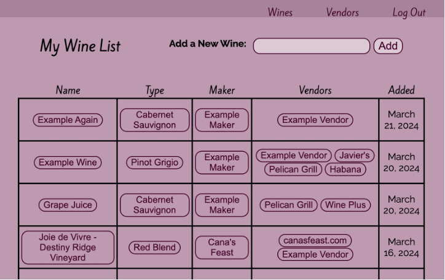

# Wine Notes
This is my unit 2 project for General Assembly's software engineering course. 
Users can enter wines they've tried and make notes on their impressions of them. Wines can be grouped together by type, maker, and vendor.

# Screenshots

# Technologies Used

- HTML
- CSS
- JavaScript
- EJS
- Node
- Express
- MongoDB
- Mongoose

# Getting Started

[Click to use the app](https://wine-notes-d7d6ff1c3ccb.herokuapp.com/oauth2callback)

# Next Steps

- Make more entities linkable from more pages
- Add a search feature